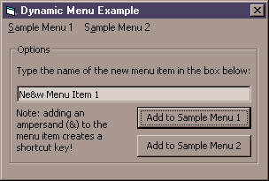

<div align="center">

## How to add new menu items to a form's existing menu at runtime\.\.\.


</div>

### Description

This code demonstrates how to add new menu items to a form's existing menu at runtime. It can be easily modified to add new menu items to other programs' menus as well.
 
### More Info
 
This is advanced Visual Basic code. If you modify this code without knowing what you are doing, it may have adverse effects on your system!


<span>             |<span>
---                |---
**Submitted On**   |2001-01-17 11:46:42
**By**             |[Daniel S\. Soper](https://github.com/Planet-Source-Code/PSCIndex/blob/master/ByAuthor/daniel-s-soper.md)
**Level**          |Advanced
**User Rating**    |4.7 (14 globes from 3 users)
**Compatibility**  |VB 6\.0
**Category**       |[Custom Controls/ Forms/  Menus](https://github.com/Planet-Source-Code/PSCIndex/blob/master/ByCategory/custom-controls-forms-menus__1-4.md)
**World**          |[Visual Basic](https://github.com/Planet-Source-Code/PSCIndex/blob/master/ByWorld/visual-basic.md)
**Archive File**   |[CODE\_UPLOAD138591172001\.zip](https://github.com/Planet-Source-Code/daniel-s-soper-how-to-add-new-menu-items-to-a-form-s-existing-menu-at-runtime__1-14480/archive/master.zip)

### API Declarations

```
The following API's are used in this program:
GetMenu
GetSubMenu
GetMenuItemCount
InsertMenuItem
SetMenuItemInfo
SetWindowLong
CallWindowProc
```


